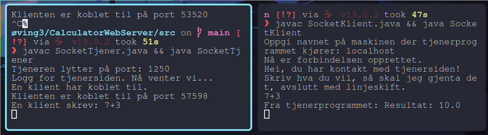

# Rapport - Kommunikasjon mellom nettverksapplikasjoner

- **Innholdsfortegnelse:**
	- [[#P3: Sockets, TCP, HTTP og tråder ]]
		- [[#Enkel klient/tjener ]]
		- [[#Flere samtidige klienter ]]
		- [[#Enkel webtjener med nettleser som klient ]]
	- [[#P4: UDP, TLS, ASIO ]]
		- [[#UDP kalkulator ]]
		- [[#TLS ]]

> [!NOTE] Eksport av pakker
> Eksport av alle sesjonene er å finne på url:
> - https://github.com/Stianlyng/NTNU/tree/main/idatt2104/datakommunikasjon1


# P3: Sockets, TCP, HTTP og tråder 
## Enkel klient/tjener 

En socket tjener som lytter etter inkommende klienter på port 1250. Når en klient kobler til, åpner tjeneren _input_ og _output_-strømmer for håndtere klient/tjener kommunikasjonen.

Når kommunkasjonen er oppnådd sender tjeneren en melding til klienten, som tydeliggjør at forbindelsen er oppnådd og videre instruksjoner til klienten.

```java
skriveren.println("Hei, du har kontakt med tjenersiden!");
skriveren.println("Skriv hva du vil, så skal jeg gjenta det, avslutt med linjeskift.");
```

Videre venter tjeneren på å motta data fra klienten. I dette tilfellet skulle et matematisk uttrykk evalueres av klienten og sende resultatet tilbake. Siden dataen som mottas er av typen _string_ vil kalkulator klassen ha et argument av datatypen _String_, og videre ta seg av konvertering og evaluering.

Kalkulatorklassen returnerer resultatet som en _Double_ som igjen konverteres tilbake til en _String_ og sender resultatet tilbake til klienten.

- **IP:** localhost
- **Transportlag:** TCP
- **Port:**
	- **Tjener:** 1250
	- **Klient:** 49152 - 65535*

> \* Klientens dynamiske porter etter handshake med tjeneren

### Protokoller på transport- og nettverkslag  

Applikasjonen benytter seg av TCP som transportlag, og IP-protokollen (IPv4) som nettverkslag. 

Oppstart av tjeneren er første steg i prosessen. Tjeneren lytter på port 1250 og venter på inkommende tilkobling av klienten. For å etablere forbindelsen mellom tjeneren og klienten benyttes en _TCP 3-way handshake_. 

### TCP 3-way handshake

> [!NOTE] _En 3 stegs prosess_
> - **Steg 1 - SYN:**  Klienten setter SYN flagget til 1 og sender pakken med følgende informasjon til tjeneren:
> 	- SYN flagg = 1
>	- _Initial Sequence Number (ISN)_(tilfeldig 32 bits tall)
>	- Vindustørrelse
>	- _Maximum Segment Size (MMS)_
>	- Ugyldig kvitteringsnummer
>- **Steg 2 - SYN-ACK:** Tjeneren svarer med å sette ACK flagget til 1:
>	- ACK flagg = 1
>	- SYN flagg = 1
>	- Sekvensnummeret = $\text{ISN}_2$ 
>	- Kvitteringsnummer = $\text{ISN}_1 + 1$
> - **Steg 3 - ACK:** Klienten sender tilbake ACK flagget som 1 til tjeneren, for å vise at forbindelsen er sikret i begge retninger.
>	- Viser også at kvitteringsnummeret er likt tjenerens

**Forenklet versjon av utskriften i wireshark**

| No  | Protocol | Length | Port          | Info              |
| --- | -------- | ------ | ------------- | ----------------- |
| 1   | TCP      | 76     | 57598 → 1250  | Seq=0, SYN=1      |
| 2   | TCP      | 76     | 1250  → 57598 | Seq=0, SYN=1, ACK=1 |
| 3   | TCP      | 68     | 57598 → 1250  | Seq=1, ACK=1                 |

Utvidet skjermdump og informasjon i:
- [[#Figur: 1 - Oversikt]]
- [[#Figur 2 - Pakke nr 1 (SYN)]]
- [[#Figur 3 - Pakke nr 2 (SYN-ACK)]]
- [[#Figur 4 - Pakke nr 3 (SYN)]]

### IP-Protokollen

Basert på at man allerede i oppkoblingen i klienten oppgir `localhost` tilsier at man kjører IPv4, siden dette i de fleste systemer blir tilknyttet IPv4 loopback-adresen 127.0.0.1.

Basert på dataen i wireshark ser vi at dette stemmer:

```wireshark
Internet Protocol Version 4, Src: 127.0.0.1 (127.0.0.1), Dst: 127.0.0.1 (127.0.0.1)
```

### Overføring av data
Etter etablering av forbindelsen sender tjeneren et svar i form av en _String_ som forteller brukeren av klienten at forbindelsen er etablert.

```ASCII
0000   00 00 03 04 00 06 00 00 00 00 00 00 00 00 08 00   ................
0010   45 00 00 59 ca ef 40 00 40 06 71 ad 7f 00 00 01   E..Y..@.@.q.....
0020   7f 00 00 01 04 e2 e0 fe 25 85 1e ea 33 0e 4d aa   ........%...3.M.
0030   80 18 02 00 fe 4d 00 00 01 01 08 0a 0a 7c 7f 37   .....M.......|.7
0040   0a 7c 7f 33 48 65 69 2c 20 64 75 20 68 61 72 20   .|.3Hei, du har 
0050   6b 6f 6e 74 61 6b 74 20 6d 65 64 20 74 6a 65 6e   kontakt med tjen
0060   65 72 73 69 64 65 6e 21 0a                        ersiden!.
```

> **Utvidet skjermdump:** [[#Figur 5]]

Etter at all data og meldinger er sendt av tjeneren er fullført vil tjeneren vente på data fra klienten. 
### Kalkulatoren

Når regnestykket ankommer tjeneren vil det evalueres på tjenersiden og videre sende resultatet tilbake til klienten. 



**Forenklet beskrivelse av pakkene i evalueringen av regnestykket:**

| No  | Src/Dst   | Protocol | Length | Port         | info                                                                       |
| --- | --------- | -------- | ------ | ------------ | -------------------------------------------------------------------------- |
| 8   | localhost | TCP      | 72     | 57598 → 1250 | \[PSH, ACK\] Seq=1 Ack=105 Win=65536 Len=4 TSval=185352336 TSecr=175931191 |
| 9   | localhost | TCP      | 68     | 1250 → 57598 | [ACK] Seq=105 Ack=5 Win=65536 Len=0 TSval=185352336 TSecr=185352336        |
| 10  | localhost | TCP      | 83     | 1250 → 57598 | [PSH, ACK] Seq=105 Ack=5 Win=65536 Len=15 TSval=185352341 TSecr=185352336  |
| 11  | localhost | TCP      | 68     | 57598 → 1250 | [ACK] Seq=5 Ack=120 Win=65536 Len=0 TSval=185352341 TSecr=185352341        |

**ASCII Dump**

| No 8                                 | No 10                                |
| ------------------------------------ | ------------------------------------ |
| ![[Pasted image 20230224214658.png]] | ![[Pasted image 20230224214723.png]] |

Her ser vi et godt eksempel på at TCP-kommunikasjon utføres i parvise pakker. Pakke nr 8 sender dataen til tjeneren med en PSH,ACK-pakke, og tjeneren svarer med en ACK-pakke (nr 9) for å bekrefte mottaket. Tjeneren sender så tilbake resultatet til klienten med en PSH,ACK pakke (nr 10) etter å ha evaluert regnestykket. Slik som tidligere bekrefter klienten mottaket med en ACK-pakke (nr 11) til tjeneren.

**Utvidet skjermdump og informasjon i:**
- [[#Figur 6 - Oversikt regnestykke]]
- [[#Figur 7 - Regnestykke fra klient til tjener]]
- [[#Figur 8 - Resultat fra tjener til klient]]

## Flere samtidige klienter 

![[Pasted image 20230224221702.png]]

I terminalene over ser man tjeneren til venstre og klientene til venste. Som man ser i utskriften til tjeneren har nå klientene to ulike porter. Dette kommer som et resultat av at tjeneren lager en ny tråd for hver klientforbindelse. 

```java
public class SocketTjener implements Runnable {

  private Socket socket; // denne variabelen brukes i run-metoden

  public SocketTjener(Socket socket) {
    this.socket = socket; // konstruktøren tar imot socket som parameter
  }
```

Klassen _SocketTjener_ implementerer _Runnable_-grensesnittet og har en konstruktør som tar et _Socket_-objekt som parameter. 

Dette har skaper ingen praktisk forskjell i hvordan oppsettet fungerer på protokollnivå. Forskjellen vil ligge i flere etablerte forbindelser til den samme tjeneren. 

## Enkel webtjener med nettleser som klient 
Webtjeneren lytter etter forespørsler på port 1250. Når en klient kobler til, aksepterer tjeneren tilkoblingen, leser forespørselen sendt av klienten og sender et svar tilbake til klienten. 


![[Pasted image 20230226184743.png]]

Også i denne oppgaven brukes TCP på transportlaget over IPv4 på nettverkslaget, og starter oppkoblingen med et _3-way handshake_ som vises med SYN, SYNACK,ACK i pakke 1,2 og 3.

![[Pasted image 20230226192357.png]]

Klienten i dette tilfellet er en nettleser, der tjeneren sender et svar med en statuskode 200 OK og returnerer en velkomstmeldig med headerene som nettleseren sendte ved oppkoblingen. Når svaret er sendt, lukker serveren tilkoblingen med klienten en ny FIN/ACK handshake og venter på neste innkommende forespørsel.


> Ekstra skjermbilder: 
> - [[#Figur 12 - Webtjener Terminal output]]

**Webtjener output:**

```txt
# Du har koblet deg opp til min enkle web-tjener

-   GET / HTTP/1.1
-   Host: localhost:1250
-   User-Agent: Mozilla/5.0 (X11; Linux x86_64; rv:109.0) Gecko/20100101 Firefox/110.0
-   Accept: text/html,application/xhtml+xml,application/xml;q=0.9,image/avif,image/webp,*/*;q=0.8
-   Accept-Language: en-US,en;q=0.5
-   Accept-Encoding: gzip, deflate, br
-   Connection: keep-alive
-   Upgrade-Insecure-Requests: 1
-   Sec-Fetch-Dest: document
-   Sec-Fetch-Mode: navigate
-   Sec-Fetch-Site: none
-   Sec-Fetch-User: ?1
```

# P4: UDP, TLS, ASIO 
## UDP kalkulator 

![[Pasted image 20230225125152.png]]

I denne oppgaven skulle vi lage en enkel kalkulator-løsning hvor tjener/klient bruker UDP for kommunikasjon på transportlaget, og IPv4 på nettverkslaget. Klienten skulle sende tallene til tjeneren og få resultatet tilbake. Løsningen ble utført relativt likt den enkle TCP klient/tjener oppgaven da det ikke var noen krav til multithreading. Programmet bruker 

Klienten klassen begynner med å lage et _DatagramSocket_ objekt for å kommunisere over UDP. Klienten lager så et _DatagramPacket_ objekt med det mattematiske uttrykket representert som bytes, som videre sendes til tjeneren for evaluering.

Metodene _send()_ og _recieve()_ i _DatagramSocket_ klassen brukes for å sende og motta pakkene mellom klienten og tjeneren. 

Som nevnt er denne løsningen relativt lik den enkle løsningen fra tidligere, det er derimot noen tydelige forskjeller mellom TCP og UDP protokollene. Antallet pakker i skjermbildet under tydeliggjør denne forskjellen ganske godt.

![[Pasted image 20230226164540.png]]

Dette skyldes at UDP er designet for å minimere mengden av overhead ved å sende pakkene uten noen bekreftelse eller mekanisme for å sende de på nytt. Som nevnt er TCP kjent som en pålitelig protokoll som sikrer dataleveransen ved bruk av en 3-way handshake ved oppkobling, og ACK (_acknowledement_) pakker for å finne ut om pakkene nådde frem eller ikke. Disse mekanismene er ikke implementert i UDP, og det er derfor kjent som en upålitelig og tilkoblingsløs protokoll.

![[Pasted image 20230226172635.png]]

Om man ser på forskjellen på størrelsen av datapakken i i den enkle tjeneren ([[#Figur: 1 - Oversikt]]) og denne, vil man også se at UPD pakkene er mye mindre, som følge av mindre overhead.

Nedkobling er ikke nødvendig da man ikke på noen punkt har vært oppkoblet til noe.


## TLS 

![[Pasted image 20230225154147.png]]

Jeg hadde litt trøbbel med å kjøre eksempelkoden fra øving 4 igjen. Litt usikker på hvorfor den ikke ville kjøre når det fungerte sist. Endte uansett opp med å bruke et annet eksempel fra github. 

Eksempelet er en SSL TCP-tjeneste og klient med gjensidig SSL-autentisering. Som kobler til ved hjelp av TLSv1.2. Når klienten kjører, vil den koble til serveren, utveksle et par meldinger, før klienten sender en forespørsel om å avslutte. Serveren avslutter etter å ha håndtert én tilkobling.

Programmet demonstrerer hvordan man oppretter en sikker SSL TCP-tilkobling, og sertifikatbehandling for klientautentisering ved hjelp av key tool.

![[Pasted image 20230226174219.png]]

TLS (Transport Layer Security) er en sikkerhetsprotokoll som brukes til å etablere sikker kommunikasjon mellom to enheter over et nettverk. Bruken av TLS/SSL er veldig likt bruken av vanlig TCP-socket løsning.

Økten begynner med en SYN-pakke _3-way handshake_ som generelt er lik det vi har sett tidligere. Deretter sender klienten en Client Hello-pakke som første del av en _TLSv1.2-handshake_. Serveren svarer med Server Hello og Certificate-pakke, og klienten bekrefter begge.

Client Hello-pakken inneholder informasjon om krypteringen og nøkkelutvekslingen, samt andre detaljer som hjelper serveren med å velge riktig konfigurasjon for å opprette en sikker forbindelse, og videre svare med en Server Hello-pakke med sin egen informasjon om valgt kryptering, og resten av håndtrykket.

![[Pasted image 20230226181333.png]]

| Server Hello                         | Certificate                          |
| ------------------------------------ | ------------------------------------ |
| ![[Pasted image 20230226181549.png]] | ![[Pasted image 20230226181631.png]] |
| Sender sertifikatet vi genererte        |                                      |

Deretter sender serveren en Server Key Exchange-pakke etterfulgt av en Certificate Request-pakke og en Server Hello Done-pakke, som alle blir bekreftet av klienten. Deretter sender serveren en annen Certificate-pakke som klienten bekrefter, og klienten sender en Client Key Exchange-pakke som blir bekreftet av serveren. Til slutt sender klienten en Certificate Verify-pakke som blir bekreftet av serveren. Etter dette sender klienten en Change Cipher Spec-pakke, som bekreftes av serveren, og til slutt sender klienten en Encrypted Handshake Message, som blir bekreftet av serveren. Dette indikerer at en vellykket TLSv1.2-økt er etablert mellom klienten og serveren.

# Figurer
## Figur: 1 - Oversikt 
![[Pasted image 20230224195245.png]]
## Figur 2 - Pakke nr 1 (SYN)
```SYN
Frame 1: 76 bytes on wire (608 bits), 76 bytes captured (608 bits) on interface any, id 0
Linux cooked capture v1
Internet Protocol Version 4, Src: localhost.localdomain (127.0.0.1), Dst: localhost.localdomain (127.0.0.1)
    0100 .... = Version: 4
    .... 0101 = Header Length: 20 bytes (5)
    Differentiated Services Field: 0x00 (DSCP: CS0, ECN: Not-ECT)
    Total Length: 60
    Identification: 0xb762 (46946)
    010. .... = Flags: 0x2, Don't fragment
    ...0 0000 0000 0000 = Fragment Offset: 0
    Time to Live: 64
    Protocol: TCP (6)
    Header Checksum: 0x8557 [validation disabled]
    [Header checksum status: Unverified]
    Source Address: localhost.localdomain (127.0.0.1)
    Destination Address: localhost.localdomain (127.0.0.1)
Transmission Control Protocol, Src Port: 57598 (57598), Dst Port: swldy-sias (1250), Seq: 0, Len: 0
    Source Port: 57598 (57598)
    Destination Port: swldy-sias (1250)
    [Stream index: 0]
    [Conversation completeness: Incomplete, DATA (15)]
    [TCP Segment Len: 0]
    Sequence Number: 0    (relative sequence number)
    Sequence Number (raw): 856575401
    [Next Sequence Number: 1    (relative sequence number)]
    Acknowledgment Number: 0
    Acknowledgment number (raw): 0
    1010 .... = Header Length: 40 bytes (10)
    Flags: 0x002 (SYN)
        000. .... .... = Reserved: Not set
        ...0 .... .... = Accurate ECN: Not set
        .... 0... .... = Congestion Window Reduced: Not set
        .... .0.. .... = ECN-Echo: Not set
        .... ..0. .... = Urgent: Not set
        .... ...0 .... = Acknowledgment: Not set
        .... .... 0... = Push: Not set
        .... .... .0.. = Reset: Not set
        .... .... ..1. = Syn: Set
        .... .... ...0 = Fin: Not set
        [TCP Flags: ··········S·]
    Window: 65495
    [Calculated window size: 65495]
    Checksum: 0xfe30 [unverified]
    [Checksum Status: Unverified]
    Urgent Pointer: 0
    Options: (20 bytes), Maximum segment size, SACK permitted, Timestamps, No-Operation (NOP), Window scale
        TCP Option - Maximum segment size: 65495 bytes
            Kind: Maximum Segment Size (2)
            Length: 4
            MSS Value: 65495
        TCP Option - SACK permitted
            Kind: SACK Permitted (4)
            Length: 2
        TCP Option - Timestamps
            Kind: Time Stamp Option (8)
            Length: 10
            Timestamp value: 175931187: TSval 175931187, TSecr 0
            Timestamp echo reply: 0
        TCP Option - No-Operation (NOP)
            Kind: No-Operation (1)
        TCP Option - Window scale: 7 (multiply by 128)
            Kind: Window Scale (3)
            Length: 3
            Shift count: 7
            [Multiplier: 128]
    [Timestamps]
```

## Figur 3 - Pakke nr 2 (SYN-ACK)
```
Frame 2: 76 bytes on wire (608 bits), 76 bytes captured (608 bits) on interface any, id 0
Linux cooked capture v1
Internet Protocol Version 4, Src: localhost.localdomain (127.0.0.1), Dst: localhost.localdomain (127.0.0.1)
    0100 .... = Version: 4
    .... 0101 = Header Length: 20 bytes (5)
    Differentiated Services Field: 0x00 (DSCP: CS0, ECN: Not-ECT)
    Total Length: 60
    Identification: 0x0000 (0)
    010. .... = Flags: 0x2, Don't fragment
    ...0 0000 0000 0000 = Fragment Offset: 0
    Time to Live: 64
    Protocol: TCP (6)
    Header Checksum: 0x3cba [validation disabled]
    [Header checksum status: Unverified]
    Source Address: localhost.localdomain (127.0.0.1)
    Destination Address: localhost.localdomain (127.0.0.1)
Transmission Control Protocol, Src Port: swldy-sias (1250), Dst Port: 57598 (57598), Seq: 0, Ack: 1, Len: 0
    Source Port: swldy-sias (1250)
    Destination Port: 57598 (57598)
    [Stream index: 0]
    [Conversation completeness: Incomplete, DATA (15)]
    [TCP Segment Len: 0]
    Sequence Number: 0    (relative sequence number)
    Sequence Number (raw): 629481193
    [Next Sequence Number: 1    (relative sequence number)]
    Acknowledgment Number: 1    (relative ack number)
    Acknowledgment number (raw): 856575402
    1010 .... = Header Length: 40 bytes (10)
    Flags: 0x012 (SYN, ACK)
        000. .... .... = Reserved: Not set
        ...0 .... .... = Accurate ECN: Not set
        .... 0... .... = Congestion Window Reduced: Not set
        .... .0.. .... = ECN-Echo: Not set
        .... ..0. .... = Urgent: Not set
        .... ...1 .... = Acknowledgment: Set
        .... .... 0... = Push: Not set
        .... .... .0.. = Reset: Not set
        .... .... ..1. = Syn: Set
        .... .... ...0 = Fin: Not set
        [TCP Flags: ·······A··S·]
    Window: 65483
    [Calculated window size: 65483]
    Checksum: 0xfe30 [unverified]
    [Checksum Status: Unverified]
    Urgent Pointer: 0
    Options: (20 bytes), Maximum segment size, SACK permitted, Timestamps, No-Operation (NOP), Window scale
        TCP Option - Maximum segment size: 65495 bytes
            Kind: Maximum Segment Size (2)
            Length: 4
            MSS Value: 65495
        TCP Option - SACK permitted
            Kind: SACK Permitted (4)
            Length: 2
        TCP Option - Timestamps
            Kind: Time Stamp Option (8)
            Length: 10
            Timestamp value: 175931187: TSval 175931187, TSecr 175931187
            Timestamp echo reply: 175931187
        TCP Option - No-Operation (NOP)
            Kind: No-Operation (1)
        TCP Option - Window scale: 7 (multiply by 128)
            Kind: Window Scale (3)
            Length: 3
            Shift count: 7
            [Multiplier: 128]
    [Timestamps]
    [SEQ/ACK analysis]

```

## Figur 4 - Pakke nr 3 (SYN)
```ACK
Frame 3: 68 bytes on wire (544 bits), 68 bytes captured (544 bits) on interface any, id 0
Linux cooked capture v1
Internet Protocol Version 4, Src: localhost.localdomain (127.0.0.1), Dst: localhost.localdomain (127.0.0.1)
    0100 .... = Version: 4
    .... 0101 = Header Length: 20 bytes (5)
    Differentiated Services Field: 0x00 (DSCP: CS0, ECN: Not-ECT)
    Total Length: 52
    Identification: 0xb763 (46947)
    010. .... = Flags: 0x2, Don't fragment
    ...0 0000 0000 0000 = Fragment Offset: 0
    Time to Live: 64
    Protocol: TCP (6)
    Header Checksum: 0x855e [validation disabled]
    [Header checksum status: Unverified]
    Source Address: localhost.localdomain (127.0.0.1)
    Destination Address: localhost.localdomain (127.0.0.1)
Transmission Control Protocol, Src Port: 57598 (57598), Dst Port: swldy-sias (1250), Seq: 1, Ack: 1, Len: 0
    Source Port: 57598 (57598)
    Destination Port: swldy-sias (1250)
    [Stream index: 0]
    [Conversation completeness: Incomplete, DATA (15)]
    [TCP Segment Len: 0]
    Sequence Number: 1    (relative sequence number)
    Sequence Number (raw): 856575402
    [Next Sequence Number: 1    (relative sequence number)]
    Acknowledgment Number: 1    (relative ack number)
    Acknowledgment number (raw): 629481194
    1000 .... = Header Length: 32 bytes (8)
    Flags: 0x010 (ACK)
        000. .... .... = Reserved: Not set
        ...0 .... .... = Accurate ECN: Not set
        .... 0... .... = Congestion Window Reduced: Not set
        .... .0.. .... = ECN-Echo: Not set
        .... ..0. .... = Urgent: Not set
        .... ...1 .... = Acknowledgment: Set
        .... .... 0... = Push: Not set
        .... .... .0.. = Reset: Not set
        .... .... ..0. = Syn: Not set
        .... .... ...0 = Fin: Not set
        [TCP Flags: ·······A····]
    Window: 512
    [Calculated window size: 65536]
    [Window size scaling factor: 128]
    Checksum: 0xfe28 [unverified]
    [Checksum Status: Unverified]
    Urgent Pointer: 0
    Options: (12 bytes), No-Operation (NOP), No-Operation (NOP), Timestamps
        TCP Option - No-Operation (NOP)
            Kind: No-Operation (1)
        TCP Option - No-Operation (NOP)
            Kind: No-Operation (1)
        TCP Option - Timestamps
            Kind: Time Stamp Option (8)
            Length: 10
            Timestamp value: 175931187: TSval 175931187, TSecr 175931187
            Timestamp echo reply: 175931187
    [Timestamps]
    [SEQ/ACK analysis]

```

## Figur 5
![[Pasted image 20230224212036.png]]

## Figur 6 - Oversikt regnestykke
![[Pasted image 20230224215620.png]]

## Figur 7 - Regnestykke fra klient til tjener
![[Pasted image 20230224215755.png]]

## Figur 8 - Resultat fra tjener til klient
![[Pasted image 20230224215851.png]]

## Figur 9 - Første kjøring TLS

![[Pasted image 20230225160107.png]]

## Figur 10 - UDP oversikt

![[Pasted image 20230226164540.png]]

## Figur 11 - UDP data
![[Pasted image 20230226172803.png]]

## Figur 12 - Webtjener Terminal output

```term
Server is online on port: 1250
Client connected
GET / HTTP/1.1
Host: localhost:1250
User-Agent: Mozilla/5.0 (X11; Linux x86_64; rv:109.0) Gecko/20100101 Firefox/110.0
Accept: text/html,application/xhtml+xml,application/xml;q=0.9,image/avif,image/webp,*/*;q=0.8
Accept-Language: en-US,en;q=0.5
Accept-Encoding: gzip, deflate, br
Connection: keep-alive
Upgrade-Insecure-Requests: 1
Sec-Fetch-Dest: document
Sec-Fetch-Mode: navigate
Sec-Fetch-Site: none
Sec-Fetch-User: ?1

Client disconnected
Client connected
GET /favicon.ico HTTP/1.1
Host: localhost:1250
User-Agent: Mozilla/5.0 (X11; Linux x86_64; rv:109.0) Gecko/20100101 Firefox/110.0
Accept: image/avif,image/webp,*/*
Accept-Language: en-US,en;q=0.5
Accept-Encoding: gzip, deflate, br
Connection: keep-alive
Referer: http://localhost:1250/
Sec-Fetch-Dest: image
Sec-Fetch-Mode: no-cors
Sec-Fetch-Site: same-origin

Client disconnected
Client connected
GET / HTTP/1.1
Host: localhost:1250
User-Agent: Mozilla/5.0 (X11; Linux x86_64; rv:109.0) Gecko/20100101 Firefox/110.0
Accept: text/html,application/xhtml+xml,application/xml;q=0.9,image/avif,image/webp,*/*;q=0.8
Accept-Language: en-US,en;q=0.5
Accept-Encoding: gzip, deflate, br
DNT: 1
Connection: keep-alive
Upgrade-Insecure-Requests: 1
Sec-Fetch-Dest: document
Sec-Fetch-Mode: navigate
Sec-Fetch-Site: cross-site
Pragma: no-cache
Cache-Control: no-cache

Client disconnected
```

